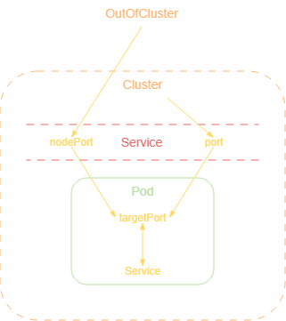

+++ 
draft = false
date = 2025-11-13T02:50:40Z
title = "Distinguish port and targetPort in Kubernetes Services"
description = ""
slug = ""
authors = ["Duc-Huy Ngo"]
tags = ["k8s", "kubernetes", "service", "port", "targetport"]
categories = ["engineer", "system"]
externalLink = ""
series = []
+++

When working with K8s services, you may come accross two fields: `port` and `targetPort` in the service specification. They may seem, and oftenly used, interchangeably, but they actually have different meanings and purposes.

Example of a service.yaml specification:

```yaml
apiVersion: v1
kind: Service
metadata:
  name: my-service
spec:
    type: NodePort
    selector:
        app.kubernetes.io/name: MyApp
    ports:
        - protocol: TCP
          port: 80
          targetPort: 8080
          nodePort: 30080
```

This service exposes an application running on port `8080` inside the pod to be accessible via port `30080` from outside the K8s cluster.

But what do the field `port` mean here?

When you create a pod, if you want to expose a container's port to the outside of the pod, you can manually forward a port or define a service that automatically maps the `targetPort` or the port of the container to a `port` on the service or a `nodePort` for external access.



### In summary:
- `port`: This is the port that the service exposes inside the cluster for other pods within the cluster can access.
- `targetPort`: This is the port on the container that the service forwards traffic to.
- `nodePort`: This is the port that the service exposes outside the cluster for external clients can access.


